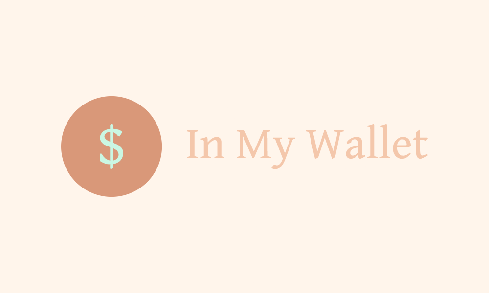

[![LinkedIn][linkedin-shield]][linkedin-url]
[![MIT License][license-shield]][license-url]


<!-- PROJECT LOGO -->
<br />
<p align="center">
  <a href="https://inmywallet.herokuapp.com/">
    
  </a>

  <h3 align="center">InMyWallet App</h3>

  <p align="center">
   An Expenditure Accountability App
    <br />
    <a href="https://inmywallet.herokuapp.com/">View Demo WebApp</a>
  </p>
</p>

<!-- TABLE OF CONTENTS -->
<details open="open">
  <summary>Table of Contents</summary>
  <ol>
    <li>
      <a href="#about-the-project">About The Project</a>
      <ul>
        <li><a href="#Tech-Stack">Technology Stack</a></li>
      </ul>
    </li>
    <li>
      <a href="#getting-started">Getting Started</a>
      <ul>
        <li><a href="#prerequisites">Prerequisites</a></li>
        <li><a href="#installation">Installation</a></li>
      </ul>
    </li>
    <li><a href="#usage">Usage</a></li>
    <li><a href="#license">License</a></li>
    <li><a href="#contact">Contact</a></li>
  </ol>
</details>


<!-- ABOUT THE PROJECT -->
## About The Project

[![Product Name Screen Shot][product-screenshot]](https://example.com)
 
I decided to create a simple tracker to track my expenses as i'm starting to lose track of my spendings. This app is straightforward, nothing fancy and serves it deep purpose of being a tracker. 

My idea behind this:
* Your time should be focused on creating something amazing. A project that solves a problem and helps others (including myself)
* Simple minimalistic UI design to be straightforward as possible.
* Utilised a Web application in order to serve people who are not familiar with utilising an App store (Older Gen) to download applications. 
* Can be used on all mobile platforms including the common Android OS and iOS

## Tech Stack

Frameworks used to built my project.
### Frontend
* [HTML](https://getbootstrap.com)
* [CSS](https://jquery.com)
* [React Js](https://laravel.com)

### Backend
* [Node Js](https://laravel.com)
* [Express Js](https://laravel.com)
* [MongoDB](https://laravel.com)


<!-- GETTING STARTED -->
## Getting Started

To get a local copy up and running follow these simple example steps.

### Prerequisites

* npm
  ```sh
  npm install npm@latest -g
  ```

### Installation

1. Clone the repo
   ```sh
   git clone https://github.com/sashitharan/expenditure-accountability-app.git
   ```
2. Install NPM packages
   ```sh
   npm install
   ```
3. Change config.env file in config folder in `config.env`
   ```JS
   MONGO_URI = 'ENTER YOUR URI';
   ```


<!-- USAGE EXAMPLES -->
## Usage

  ``` npm install
 cd frontend 
 npm install
 cd .. (Go back to root)
 
 # Run frontend and backend concurrently
 npm run dev
 
 # Backend only
 npm run server
 
 # Frontend only
 npm run client
 
 # To Build client
 cd client
 npm run build
  ```
 # Production
 Remember to change environment variable in config.env fileto 'production' or 'development'
   ```JS
   NODE_ENV = production;
   ```
Once in Production
   ```
   npm start
 ```

<!-- LICENSE -->
## License
Distributed under the MIT License. See `LICENSE` for more information.


<!-- CONTACT -->
## Contact

Lets Connect - [@Sashitharan](https://www.linkedin.com/in/sashitharan/) - sarsheyy@gmail.com

Project Link: [https://github.com/sashitharan/expenditure-accountability-app](https://github.com/sashitharan/expenditure-accountability-app)

Web Application Link: [https://inmywallet.herokuapp.com/](https://inmywallet.herokuapp.com/)


<!-- MARKDOWN LINKS & IMAGES -->
<!-- https://www.markdownguide.org/basic-syntax/#reference-style-links -->
[license-shield]: https://img.shields.io/github/license/othneildrew/Best-README-Template.svg?style=for-the-badge
[license-url]: https://github.com/othneildrew/Best-README-Template/blob/master/LICENSE.txt
[linkedin-shield]: https://img.shields.io/badge/-LinkedIn-black.svg?style=for-the-badge&logo=linkedin&colorB=555
[linkedin-url]: https://www.linkedin.com/in/sashitharan/
[product-screenshot]: images/screenshot.png
